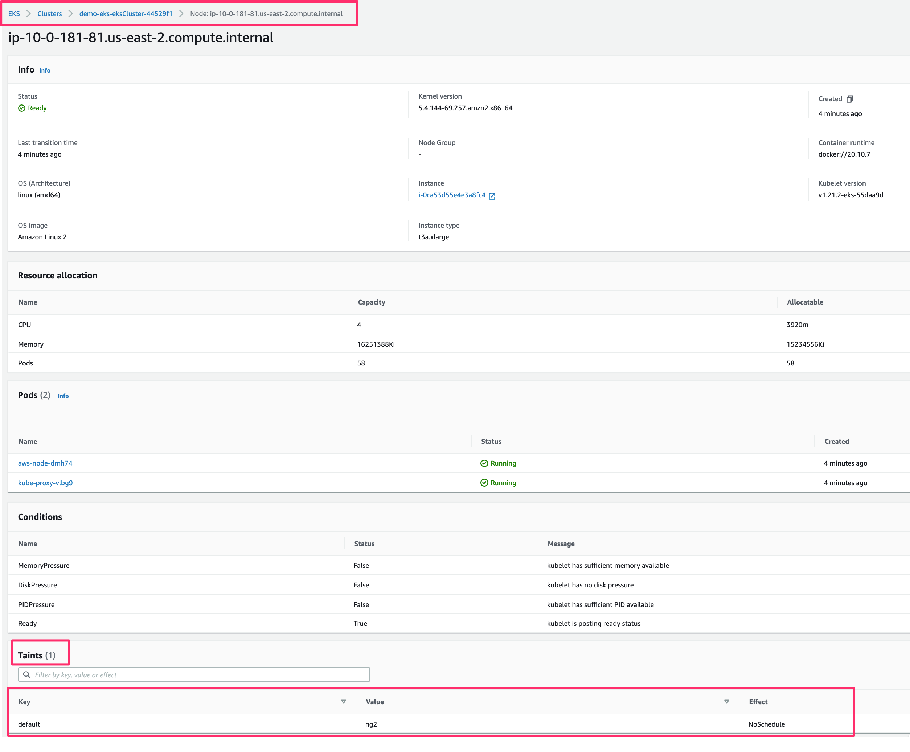

# AWS EKS with a Fixed Nodgroup with no Taints and a Spot Nodegroup with Taints

AWS eks stood up in a vpc with no managednodgroup, a fixed nodegroup with no taints, and a spot nodegroup with taints in typescript

## Deployment

1. Initialize a new stack called: `dev` via [pulumi stack init](https://www.pulumi.com/docs/reference/cli/pulumi_stack_init/).

   ```bash
   pulumi stack init dev
   ```

1. Create a Python virtualenv, activate it, and install dependencies:
   ```bash
   npm install
   ```

1. View the current config settings. This will be empty.

   ```bash
   pulumi config
   ```

   ```bash
   KEY                     VALUE
   ```

1. Populate the config.  Here are aws [endpoints](https://docs.aws.amazon.com/general/latest/gr/rande.html)
      ```bash
   pulumi config set aws:region us-east-2 # any valid aws region
   ```

1. Launch

   ```bash
   pulumi up -y
   ```

   Results
   ```bash
    Previewing update (dev)

    View Live: https://app.pulumi.com/shaht/aws-classic-ts-eks-nodetaint/dev/updates/3

     Type                         Name                                Status       
      +   pulumi:pulumi:Stack          aws-classic-ts-eks-nodetaint-dev    creating...  
      +   ├─ awsx:x:ec2:Vpc                 demo-vpc                            creating.    
      +   │  ├─ awsx:x:ec2:Subnet           demo-vpc-private-2                  creating..   
      +   │  ├─ awsx:x:ec2:Subnet           demo-vpc-public-2                   creating     
      +   │  ├─ awsx:x:ec2:Subnet           demo-vpc-public-2                   created      
      +   │  ├─ awsx:x:ec2:NatGateway       demo-vpc-0                          creating...  
      +   │  │  └─ aws:ec2:Eip              demo-vpc-0                          creating     
      +   │  ├─ awsx:x:ec2:Subnet           demo-vpc-public-1                   creating...  
      +   │  ├─ awsx:x:ec2:Subnet           demo-vpc-private-1                  creating...  
      +   │  ├─ awsx:x:ec2:Subnet           demo-vpc-public-0                   created      
      +   │  ├─ awsx:x:ec2:NatGateway       demo-vpc-0                          created      
      +   │  ├─ awsx:x:ec2:Subnet           demo-vpc-private-0                  created      
      +   │  │  └─ aws:ec2:RouteTable       demo-vpc-private-0                  creating..   
      +   │  │  └─ aws:ec2:RouteTable       demo-vpc-private-0                  creating..   
      +   │  │  └─ aws:ec2:RouteTable       demo-vpc-private-0                  creating..   
      +   │  │  └─ aws:ec2:RouteTable       demo-vpc-private-0                  creating..   
      +   │  │  └─ aws:ec2:RouteTable       demo-vpc-private-0                  creating..   
      +   │  │  └─ aws:ec2:RouteTable       demo-vpc-private-0                  creating..   
      +   │  │  └─ aws:ec2:RouteTable       demo-vpc-private-0                  creating..   
      +   │  │  └─ aws:ec2:Subnet           demo-vpc-private-0                  creating..   
      +   │  │  └─ aws:ec2:Subnet           demo-vpc-private-0                  creating..   
      +   │  │  └─ aws:ec2:Subnet           demo-vpc-private-0                  creating..   
      +   │  │  └─ aws:ec2:Subnet           demo-vpc-private-0                  creating..   
      +   │  │  └─ aws:ec2:Subnet           demo-vpc-private-0                  creating..   
      +   │  │  └─ aws:ec2:Subnet           demo-vpc-private-0                  created      
      +   │  │  └─ aws:ec2:Subnet           demo-vpc-private-0                  created      
      +   │  │  └─ aws:ec2:Subnet           demo-vpc-private-0                  created      
      +   │  │  └─ aws:ec2:Subnet                 demo-vpc-private-0                  created      
      +   │  │  └─ aws:ec2:RouteTableAssociation  demo-vpc-private-0                  creating     
      +   │  │  └─ aws:ec2:RouteTableAssociation  demo-vpc-private-0                  creating     
      +   │  │  └─ aws:ec2:RouteTableAssociation  demo-vpc-private-0                  created      
      +   │  │  └─ aws:ec2:RouteTableAssociation  demo-vpc-private-0                  created      
      +   │  │  └─ aws:ec2:RouteTableAssociation  demo-vpc-private-0                  created      
      +   │  │  └─ aws:ec2:RouteTableAssociation  demo-vpc-private-0                  created      
      +   │  │  └─ aws:ec2:NatGateway             demo-vpc-0                          creating..   
      +   ├─ aws:iam:Policy                       AWSLoadBalancerControllerIAMPolicy  created      
      +   ├─ aws:iam:Policy                       EKSClusterAutoscalePolicy           created      
      +   │  │  └─ aws:ec2:NatGateway             demo-vpc-0                          creating     
      +   │  │  └─ aws:ec2:NatGateway             demo-vpc-0                          creating.    
      +   ├─ aws:iam:RolePolicyAttachment         demo-role-0-policy-0                created      
      +   ├─ aws:iam:RolePolicyAttachment         demo-role-0-policy-1                created      
      +   ├─ aws:iam:RolePolicyAttachment         demo-role-0-policy-3                created      
      +   │  │  └─ aws:ec2:NatGateway             demo-vpc-0                          creating...  
      +   ├─ aws:iam:InstanceProfile              demo-instanceProfile-0              created      
      +   ├─ eks:index:NodeGroup                  demo-nodegroup-fixed                   created      
      +   │  │  └─ aws:ec2:NatGateway             demo-vpc-0                             creating     
      +   │  └─ eks:index:RandomSuffix            demo-nodegroup-fixed-cfnStackName      created      
      +   │  └─ eks:index:RandomSuffix            demo-nodegroup-fixed-cfnStackName      created      
      +   │  └─ eks:index:RandomSuffix            demo-nodegroup-fixed-cfnStackName      created      
      +   pulumi:pulumi:Stack                     aws-classic-ts-eks-nodetaint-dev       creating     
      +   │  ├─ eks:index:RandomSuffix            demo-nodegroup-spot-cfnStackName       created      
      +   │  ├─ eks:index:RandomSuffix            demo-nodegroup-spot-cfnStackName        created      
      +   │  └─ aws:ec2:SecurityGroup             demo-nodegroup-spot-nodeSecurityGroup   creating.    
      +   └─ eks:index:Cluster                    demo-eks                                creating.    
      +   │  └─ aws:ec2:SecurityGroup             demo-nodegroup-spot-nodeSecurityGroup   creating..   
      +   │  └─ aws:ec2:SecurityGroup             demo-nodegroup-spot-nodeSecurityGroup   creating...  
      +      │  ├─ aws:iam:Role                   demo-eks-eksRole-role                          created      
      +      │  ├─ aws:iam:Role                   demo-eks-eksRole-role                          created      
      +      │  ├─ aws:iam:Role                   demo-eks-eksRole-role                          created      
      +      │  ├─ aws:iam:Role                   demo-eks-eksRole-role                          created      
      +      │  ├─ aws:iam:Role                   demo-eks-eksRole-role                                  created      
      +      │  ├─ aws:iam:RolePolicyAttachment   demo-eks-eksRole-90eb1c99                              created      
      +      │  └─ aws:iam:RolePolicyAttachment   demo-eks-eksRole-4b490823                              created      
      +      ├─ aws:ec2:SecurityGroup             demo-eks-eksClusterSecurityGroup                       created      
      +      ├─ aws:ec2:SecurityGroupRule         demo-eks-eksClusterInternetEgressRule                  created      
      +      ├─ aws:eks:Cluster                   demo-eks-eksCluster                                    created      Cluster is ready
      +      ├─ aws:eks:Cluster                   demo-eks-eksCluster                                    created      Cluster is ready
      +      ├─ aws:eks:Cluster                   demo-eks-eksCluster                                    created      Cluster is ready
      +      ├─ aws:eks:Cluster                   demo-eks-eksCluster                                    created      Cluster is ready
      +      ├─ aws:eks:Cluster                   demo-eks-eksCluster                                     created      Cluster is ready
      +      ├─ aws:eks:Cluster                   demo-eks-eksCluster                                     created      Cluster is ready
      +      ├─ aws:eks:Cluster                   demo-eks-eksCluster                                     created      Cluster is ready
      +      ├─ aws:eks:Cluster                   demo-eks-eksCluster                                     created      Cluster is ready
      +      ├─ aws:eks:Cluster                   demo-eks-eksCluster                                     created      Cluster is ready
      +      ├─ aws:eks:Cluster                   demo-eks-eksCluster                                     created      Cluster is ready
      +      ├─ aws:ec2:SecurityGroup             demo-eks-nodeSecurityGroup                              created     
      +      ├─ pulumi:providers:kubernetes       demo-eks-eks-k8s                                        created     
      +      ├─ eks:index:VpcCni                  demo-eks-vpc-cni                                        created     
      +      ├─ pulumi:providers:kubernetes       demo-eks-provider                                       created     
      +      ├─ kubernetes:core/v1:ConfigMap      demo-eks-nodeAccess                                     created     
      +      ├─ aws:ec2:SecurityGroupRule         demo-eks-eksClusterIngressRule                          created     
      +      ├─ aws:ec2:SecurityGroupRule         demo-eks-eksExtApiServerClusterIngressRule              created     
      +      ├─ aws:ec2:SecurityGroupRule         demo-eks-eksNodeIngressRule                             created     
      +      ├─ aws:ec2:SecurityGroupRule         demo-eks-eksNodeClusterIngressRule                      created     
      +      └─ aws:ec2:SecurityGroupRule         demo-eks-eksNodeInternetEgressRule                      created     
      
      Diagnostics:
      pulumi:pulumi:Stack (aws-classic-ts-eks-nodetaint-dev):
         Warning: apiextensions.k8s.io/v1beta1 CustomResourceDefinition is deprecated in v1.16+, unavailable in v1.22+; use apiextensions.k8s.io/v1 CustomResourceDefinition
      
      Outputs:
         cluster_name  : "demo-eks-eksCluster-44529f1"
         cluster_verion: "1.21"
         kubeconfig    : "[secret]"

      Resources:
         + 85 created

      Duration: 12m7s
   ```

1. View the outputs.
   ```bash
   pulumi stack output
   ```

   Results
   ```bash
    Current stack outputs (3):
    OUTPUT          VALUE
    cluster_name    demo-eks-eksCluster-44529f1
    cluster_verion  1.21
    kubeconfig      [secret
   ```

   If you need to see the value in kubeconfig, you will have to do the following
   ```bash
   pulumi stack output --show-secrets
   ```

1. Validating that the **taints** were applied via the aws console.
   - log in via aws console, check out the eks cluster, select the node and scroll down to `Taints`.  You will something like the following

   


1. Validating that the **taints** were applied via the cli.
   Create the kubeconfig
   ```bash
   pulumi stack output kubeconfig --show-secrets >kubeconfig
   export KUBECONFIG=`PWD`/kubeconfig
   kubectl version
   ```

1. Check for taints via [how to extract the list of nodes that are tainted](https://discuss.kubernetes.io/t/how-to-extract-the-list-of-nodes-which-are-tainted/8335/13)
   ```bash
   kubectl get node -o custom-columns=NAME:.metadata.name,TAINT:.spec.taints[*].effect
   ```

   Expected Results: 3 to say *NoSchedule* and 3 to say **`<none>`**
   ```bash
      NAME                                         TAINT
   ip-10-0-102-20.us-east-2.compute.internal    <none>
   ip-10-0-126-40.us-east-2.compute.internal    NoSchedule
   ip-10-0-135-231.us-east-2.compute.internal   NoSchedule
   ip-10-0-155-71.us-east-2.compute.internal    <none>
   ip-10-0-181-81.us-east-2.compute.internal    NoSchedule
   ip-10-0-186-181.us-east-2.compute.internal   <none>
   ```

1. Clean up kubeconfig
   ```bash
   unset KUBECONFIG
   rm kubeconfig
   ```

1. Clean up
   ```bash
   pulumi destroy -y
   ```

1. Remove.  This will remove the *Pulumi.dev.yaml* file also
   ```bash
   pulumi stack rm dev -y
   ```